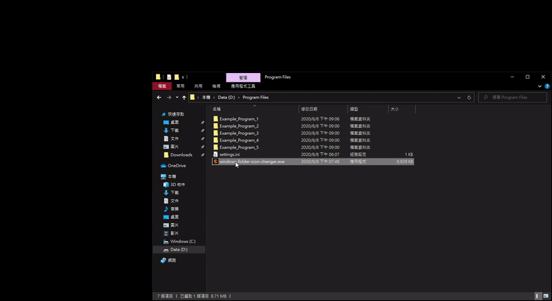

# windows-folder-icon-changer

## Usage

1. Modify `settings.ini`
2. Run `windows-folder-icon-changer.exe`
3. Select the folder (e.g. Program Files)
4. Select the `settings.ini`
5. Wait for the program to finish

## DEMO

## Icon links

- [twitter-logo](https://icon-icons.com/icon/twitter-logo/149062)
- [apple-logo](https://icon-icons.com/icon/apple-logo/149061)
- [instagram-logo](https://icon-icons.com/icon/instagram-logo/149066)
- [facebook-logo](https://icon-icons.com/icon/facebook-logo/149063)
- [youtube-logo](https://icon-icons.com/icon/youtube-logo/149060)
